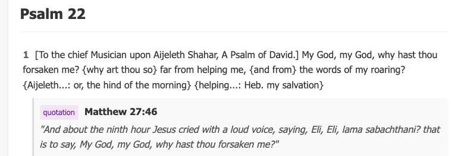

# Biblical Discovery Engine

> An interactive platform for exploring biblical texts through organic "hyperlinks" and guided discovery


## 🌟 Vision

Biblical Discovery Engine aims to revolutionize how people study and explore biblical texts by surfacing organic connections between passages, cultural contexts, and theological concepts. Rather than presenting pre-defined relationships, the system enables:

- **Organic Discovery** - Find connections as you read, not just what commentaries tell you
- **Multidimensional Exploration** - Connect passages through thematic, linguistic, historical, and cultural lenses
- **Guided Learning** - AI-assisted exploration that respects theological boundaries
- **Collaborative Understanding** - Build on the insights of other explorers over time

## 🚧 Current Status

This project is in **early prototype stage**. Currently implemented:

- Basic UI framework for passage display
- Connection visualization interface
- Relationship strength indicators
- Multi-faceted exploration tabs

### App Initialization
Activate your venv or create one
```bash 
source venv/bin/activate
```
Install requirements and run the FastAPI app using Uvicorn:

```bash
pip install -r requirements.txt
uvicorn app.main:app --reload
```



## 🛣️ Roadmap

### Phase 1: Foundation (Current)
- [x] Initial UI design and component structure
- [x] Static demonstration of connection types
- [x] Passage navigation system
- [x] Basic search functionality

### Phase 2: Connection Engine
- [ ] Embedding models for biblical texts
- [ ] Simple connection discovery algorithms
- [ ] Integration with open-source biblical APIs
- [ ] Connection strength evaluation metrics

### Phase 3: Intelligence
- [ ] Fine-tuned LLM for biblical exploration
- [ ] Cross-reference detection system
- [ ] Temporal analysis of theological concepts
- [ ] Cultural context integration

### Phase 4: Advanced Features
- [ ] Collaborative discovery and annotation
- [ ] Personal insights collection
- [ ] Advanced visualization of concept networks
- [ ] Custom exploration paths based on interests

## 💡 Technical Innovation

This project explores several novel technical approaches:

1. **Organic Hyperlink Discovery** - Using transformer models to detect non-obvious connections between passages
2. **Strength-Based Connection Visualization** - Quantifying and visualizing the relevance of connections
3. **Multi-Modal Exploration** - Combining textual, historical, and linguistic analysis in a unified interface
4. **Bounded AI Guidance** - LLM assistance that operates within defined theological and scholarly parameters

## 🧰 Tech Stack

- **Frontend**: React, TailwindCSS
- **NLP**: Transformer models, Embedding systems
- **Data**: Biblical texts, commentaries, linguistic analysis
- **Future Consideration**: Knowledge graphs, vector databases

## 🔍 Research Foundation

This project draws inspiration from:
- The concept of "hyperlinking" in biblical texts developed by **Tim Mackie, PhD** ([BibleProject](https://bibleproject.com))
- Traditional biblical exegesis methods
- Modern digital humanities approaches
- AI-assisted discovery systems
- Graph-based knowledge representation

## 🤝 Contributing

This project is currently in early development, but will eventually welcome contributions from:
- Biblical scholars
- NLP researchers
- Frontend developers
- Digital humanities experts

---

*"One thing I have asked from the Lord, that I shall seek: That I may dwell in the house of the Lord all the days of my life." - Psalm 27:4a*